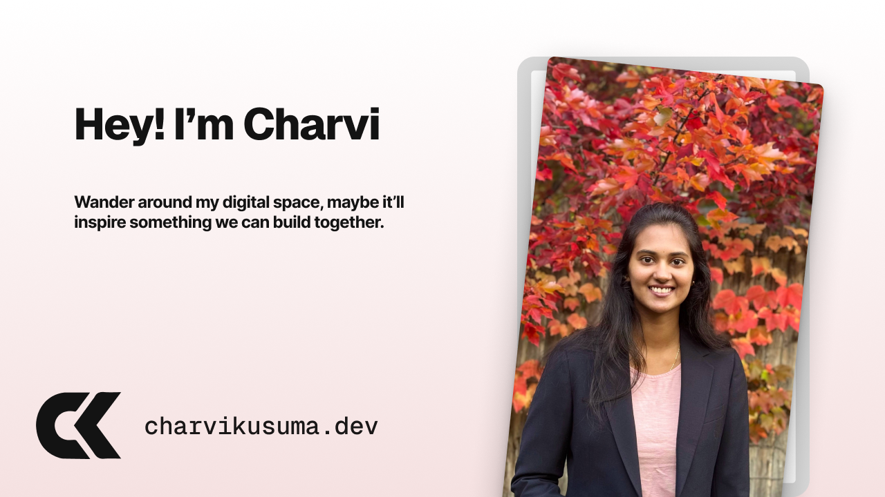

<div align="center">
  
  <h1>Charvi Kusuma | AI Engineer & Researcher</h1>
  <p>Welcome to the source code of my personal digital space. This portfolio is a curated exhibit of my journey, projects, ideas, and learnings in the world of AI and software development.</p>
  <a href="https://kcharvi.github.io/">
    
  </a>
</div>

## ✨ About This Portfolio

This isn't just a static website; it's a dynamic and interactive digital portfolio designed to showcase my skills and projects in an engaging way. Built up with a modern tech stack, it features smooth animations, a component-driven architecture, and a content management system for blogs and project updates.

**[➡️ View the Live Site](https://kcharvi.github.io/)**

## 🌟 Key Features

- **Interactive UI**: Engaging user experience with animations powered by Framer Motion.
- **Component-Driven Architecture**: Built with reusable and modular React components.
- **Dynamic Content**: Blog posts and changelogs are managed via Velite, providing an easy-to-update, git-based content management system.
- **Responsive Design**: A beautiful and functional experience across all devices, from mobile phones to desktops.
- **Real-time Stats**: The `StatsBento` component fetches and displays my latest LeetCode statistics.
- **Engaging Visuals**: Features like the `PhotoGallery`, `Timeline`, and `BentoBoxes` create a playful, interactive experience.

## 🛠️ Tech Stack

This project is built with a modern, robust, and scalable technology stack:

- **Framework**: [Next.js](https://nextjs.org/) (App Router)
- **Language**: [TypeScript](https://www.typescriptlang.org/)
- **Styling**: [Tailwind CSS](https://tailwindcss.com/)
- **Animations**: [Framer Motion](https://www.framer.com/motion/)
- **Content Management**: [Velite](https://velite.js.org/) (for MDX-based content)
- **Deployment**: [GitHub Pages](https://pages.github.com/)

## 🚀 Getting Started

To get this project running locally, follow these simple steps:

1.  **Clone the repository:**

    ```bash
    git clone https://github.com/kcharvi/kcharvi.github.io.git
    cd kcharvi.github.io
    ```

2.  **Install dependencies:**

    ```bash
    npm install
    ```

3.  **Run the development server:**

    ```bash
    npm run dev
    ```

    Open [http://localhost:3000](http://localhost:3000) in your browser to see the result.

## 📁 Project Structure

The repository is structured to be clean, scalable, and easy to navigate. Here is a high-level overview of the key directories:

```
kcharvi.github.io/
├── app/                  # Main application source code (App Router)
│   ├── (pages)/          # All page components (e.g., about, projects, blog)
│   ├── components/       # Reusable React components used across the site
│   ├── data/             # Static data like projects, skills, and site metadata
│   ├── db/               # Database-related logic (actions, queries)
│   ├── lib/              # Utility functions, custom hooks, and helpers
│   └── layout.tsx        # The root layout for the application
├── content/              # MDX files for blog posts and changelogs
├── public/               # Static assets like images, fonts, and icons
└── velite.config.ts      # Configuration for the Velite content management
```

## ✨ Component Showcase

The portfolio is built on a foundation of reusable and specialized components. Here are a few highlights:

- **`BentoCard`**: The core of the "bento box" layout, used to create the grid-based design on the homepage and other pages.
- **`PhotoGallery` & `AnimatedMobilePhotos`**: Creates the interactive, animated photo collages for desktop and mobile views.
- **`MDXContent`**: Renders MDX content for blog posts and changelogs, allowing for rich text formatting and custom components within markdown.
- **`Timeline`**: A dynamic, scroll-based timeline component used to showcase my work experience on the "About" page.
- **`ScrapbookBento`**: An interactive component featuring draggable "stickers" with tooltips.

---

Credit Template: The base template I have built upon is from braydoncoyer.dev and customised components for my use case.
